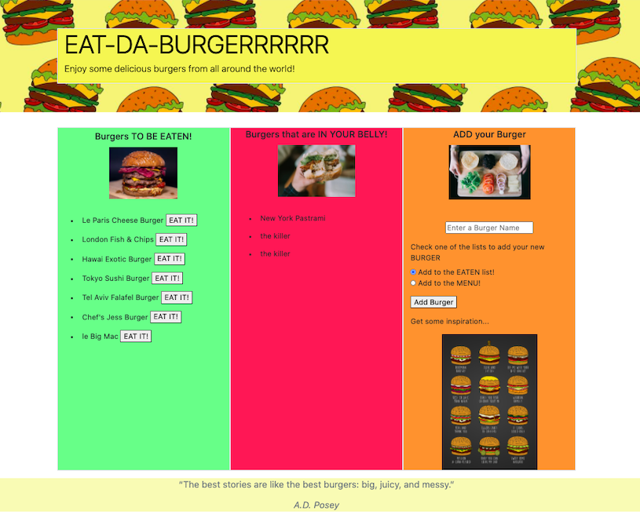

# MySQL - Employee Tracker

## Description

Created a burger logger with MySQL, Node, Express, Handlebars and a homemade ORM; using Node and MySQL to query and route data in my app, and Handlebars/Bootstrap to generate my stylish HTML.

## Table of Contents

1. [Installation](#Installation)
2. [Usage](#Usage)
3. [Github repository and Heroku deployed app link](#Github-repository-Heroku-deployed-link)
4. [App-screenshots](#App-screenshots)
5. [Questions](#Questions)

## Installation

- Make sure to `npm init` to get the `package.json` file, then `npm install` in your terminal.
- The dependencies are `mysql`, `express`, `express-handlebars` for working with database, displaying HTML pages and working with express handlebars.

## Usage

- After opening the local host port in the browser, the user is able to view a list of Burgers that are on the menu, view a list of Burgers that have been eaten and even add their own Burger to either list.

### Github-repository-Heroku-deployed-link

- Github repository:
  
- Heroku Deployed app link:
  

### App-screenshots

### Questions

For any questions about this app or if you'd like to contribute, please refer to my Github page or contact me by email!

- [JessicaPerez1 Github link:](https://github.com/JessicaPerez1/Eat-Da-Burger.git)
- 1jessicaperez@gmail.com
